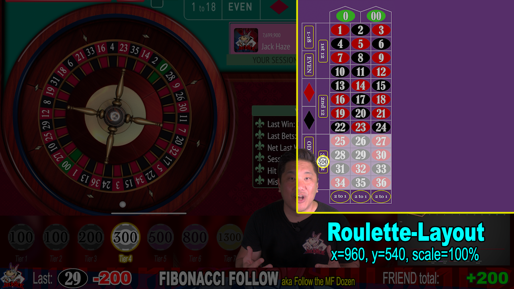

# Roulette Betting Layout

The lowest layer is the Roulette Betting layout.

|X|Y|Scale|
|-|-|-----|

|960|540|100%|

This is a full 1920x1080 graphic of the Roulette Betting Layout. It does not need to be resized or repositioned on a 1920x1080 video.

The initial state of this image is the blank roulette layout for the appropriate wheel used. If the Roulette strategy is tested using a single zero wheel, this graphic should use the layout for a single zero wheel.

The graphic should correspond to the bet currently being made in the iPad app, but it can change according to what the speaker is discussing. If the speaker is talking about wins/losses/whacks, then the graphic can be updated to display the appropriate win/loss result.

Also, if the speaker is discussing alternate betting patterns, they can be displayed here.

[Back](index.md)
