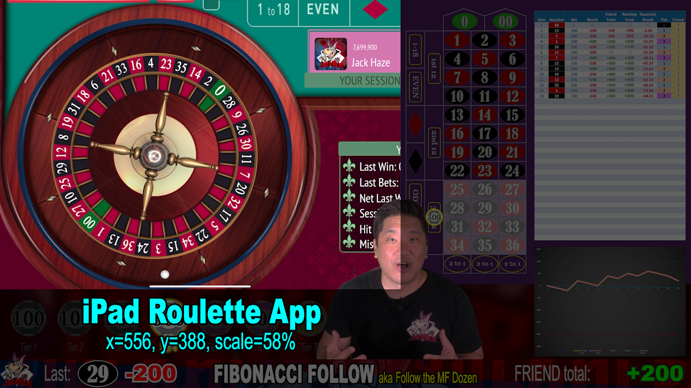

# iPad Roulette App

The iPad Roulette App is one layer above the [Roulette Betting Layout](100-Roulette-Betting-Layout.md) and one layer below the [Betting Progression](300-Betting-Progression.md). 

|X|Y|Scale|
|-|-|-----|
|556|388|58%|

This is the screen recording of me playing the Roulette app on my iPad. It needs to be scaled down and confined to the upper left corner of the screen.

Make sure the casino chip at the top of the screen recording is cropped off at the top. Make sure the white horizontal line at the bottom is hidden under the Betting Progression layer.

This layer needs to be heavily edited. Try to cut out dead video where there is no action UNLESS the speaker is speaking.

[Back](./)
