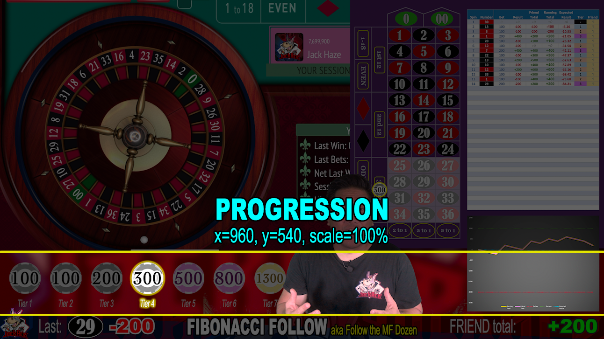

# Betting Progression

The Betting Progression layer is 1 layer above the [iPad Roulette App](200-iPad-Roulette-App.md). 

|X|Y|Scale|
|-|-|-----|
|960|540|100%|

This is a full 1920x1080 graphic of the Roulette Betting Layout. It does not need to be resized or repositioned on a 1920x1080 video.

This starts out as a blank background, but will display ALL betting levels represented with a single casino chip. The chip will display the bet amount total for the betting tier and each tier will increase from left to right.

[Back](./)
