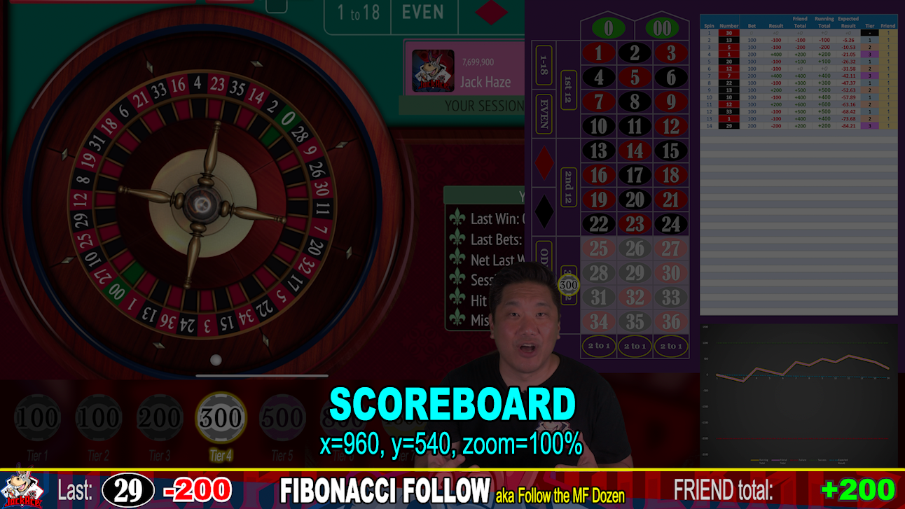

# Scoreboard

This is one of the top most layers.

|X|Y|Scale|
|-|-|-----|
|960|540|100%|

This only needs to update when the system name is mentioned (b-title) and on the first spin (c-headers).

[Back](index.md)
