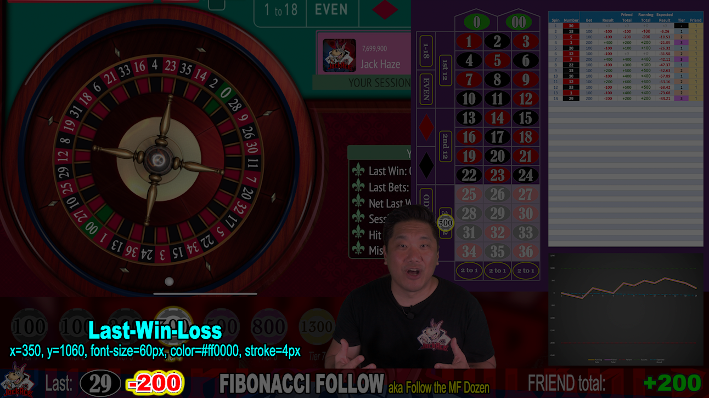

# Scoreboard - Last Win/Loss

This is a text layer above the Scoreboard.

|X|Y|Font Size|
|-|-|---------|
|350|1060|60px|

Make sure you use the following Font specifications:

* font-face: Arial Black
* font-size: 60px

## Positive Numbers

* color: #00cc00
* stroke: #666666
* stroke-width: 4px

## Negative Numbers

* color: #cc0000
* stroke: #ffffff
* stroke-width: 4px

## Zero

* color: #cccccc
* stroke: #666666
* stroke-width: 4px

This updates every spin.

[Back](index.md)
