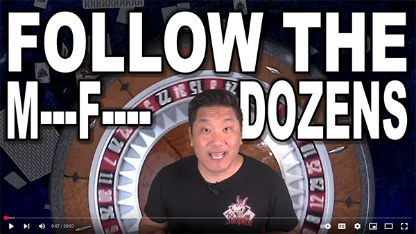

# Cold Open

The Cold Open kicks off the video and provides a "hook" to entice the viewer to watch the
whole thing.

There are 4, sometimes 5, Layers for the Cold Open. Here they are from top to bottom:

* Front Facing Cam with Green Screen
* "Over-the-Shoulder Graphic" layer (usually displays rating and system name)
* Roulette Wheel Green Screen
* Transparent Black overlay
* Be-Right-Back Looping Animation

## Front Facing Cam

This is the video of the main speaker speaking. It should be used with Ultra-key to
remove the green screen background. The Front Facing cam footage should be scaled down
by 60-75%.

## Over-the-Shoulder Graphic

This is a layer where you can display things like the system name and the CEG Rating.

## Roulete Wheel Green Screen

Display the spinning Roulette wheel behind the speaker so viewers know he's speaking
about Roulette.

## Transparent Black overlay

Use a black overlay at a 75-85% opacity to darken the animated cards falling in the
background.

## Be-Right-Back Loop

Show the Be-Right-Back looping video adjusted for 1080p (it should be scaled at 50%).
You shouldn't need more than 20 seconds (the length of the loop).

[Back](index.md)
