# Live Trials

## Adobe Premiere Pro Timeline

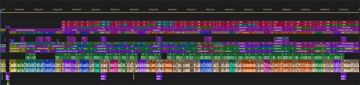

Here's a screenshot of the Adobe Premiere Pro Timeline for the Live Trials sequence.

## Adobe Premiere Pro Layers

There are approximately 12 layers you need to manage. Here they are from bottom to top.

### 1. Roulette Layout Background

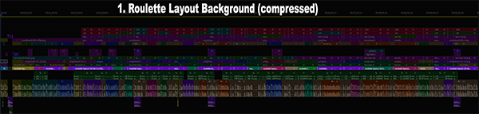

This can actually be two layers that are later compressed into one. Most of the base should
be the tier1 betting pattern for the system. This is because most systems bet tier1 the
most.

You should label these assets according to the betting tier. I like to use the following:

* Tier 1: Purple
* Tier 2: Blue
* Tier 3: Teal
* Tier 4: Magenta

The higher layer will be bets at tier2 and up. After all spins are completed, everything
from the higher layer can be compressed into the lower layer.

### 2. iPad App "Roulette Royale" (with Audio)

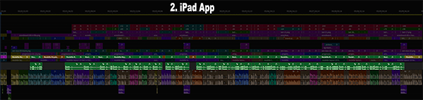

This is the layer with the iPad app. It needs to be resized and this *CAN'T* be the first
asset added to the timeline. This doesn't have a 1080p resolution, so it shouldn't be
added first.

### 3. Progression

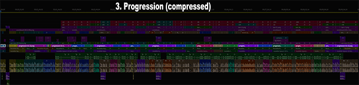

This layer shows the bet sizes for each of the betting tiers. When the speaker talks about
a betting tier or when the betting tier is bet, the appropriate tier should be highlighted.
You should label these images with the same color scheme as the Roulette Layout images.

As with the Roulette Layout layer, this layer can start out as two layers and later be
compressed into one.

### 4. Win/Loss Table

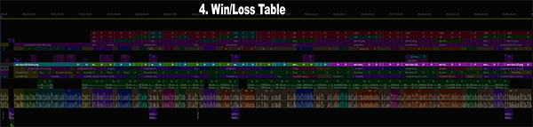

This layer shows the history of spins for the trial. It needs to change with every spin.

### 5-7. Over-the-Shoulder Graphics

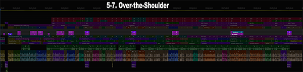

These 3 layers will be used to show graphics during the video. Some graphics include:

* House Advantage
* Wheel Coverage
* Ratings
* Lower thirds animations (e.g. "Like & Subscribe!")
* Other text

### 8. Talking Head (with Audio)

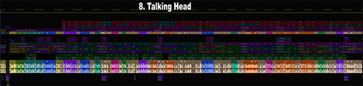

This is the layer with the speaker. Use the following labels:

* Tan: Spin-by-spin play
* Purple: Filler Fact 1
* Blue: Filler Fact 2
* Teal: Filler Fact 3
* Magenta: Filler Fact 4

### 9. Scoreboard

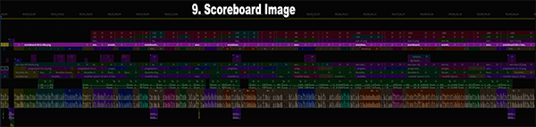

This is a mostly static layer but is consistent throught the video. It just shows the
scoreboard at the bottom of the video.

### 10. Last Spin

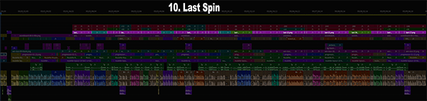

This is just a single graphic displaying the last number spun.

### 11. Last Win/Loss

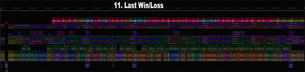

This is just a simple text element displaying the last winning or losing amount. Red for losses, Green for wins, Gray for pushes.

Use the following labels for the values displayed:

* Rose: Negative Numbers
* Green: Positive Numbers
* Violet: Zero

This makes it easier to see when the player lost or won money.

### 12. Running Total

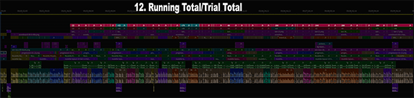

This is the running total of wins and losses for the current trial.

Use the same label conventions as with the Last Win/Loss layer. This makes it easier to see when
the player was up or down in the trial.

[Back](./)
