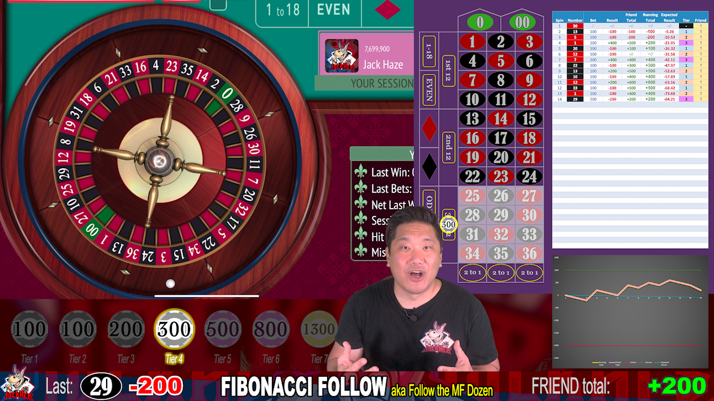

# Roulette System Review Video Guidelines

There are several components to the long form Roulette System Review Videos we edit for the JackAce YouTube channel.

Each component is in its own layer in the Adobe Premiere timeline. The bottom-most layer is underneath the other components. I've provided guideline numeric values starting with the bottom layer (the lowest number) up to the top layer (the highest number).

Here are each of the components split out:

* [100 - Roulette Layout](100-Roulette-Layout)
* [200 - iPad Roulette App](200-iPad-Roulette-App)
* [300 - Betting Progression](300-Betting-Progression)
* [500 - Front Facing Camera](500-Front-Facing-Cam)
* [800 - Win/Loss Table](800-Win-Loss-Table)
* [900 - Scoreboard](900-Scoreboard)
	* [910 - Last Number](910-Last-Spin)
	* [920 - Last Win/Loss](920-Last-Win-Loss)
	* [930 - Running Win/Loss](930-Running-Win-Loss)
